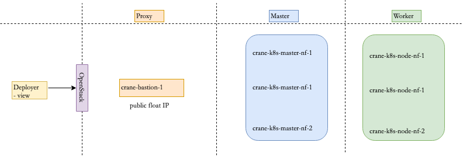

# Bootstrapping a new Kubernetes (k8s) cluster for Crane Cloud: OpenStack & Kubespray
This repo contains instructions for setting up a new Kubernetes cluster on an OpenStack cloud using Kubespray and Terraform

## Deployment Setup
We shall use the following deployment setup for the new cluster



## Specifications
The following are the specifications for the new cluster (the nodes shall be installed with Ubuntu 22.04 LTS):

|Node    |RAM |vCPU |HDD |
|--------|----|-----|----|
|Bastion |4   |2    |32  |
|Master  |8   |4    |48  |
|Worker  |16  |8    |100 |

## Prerequisites
A working OpenStack cloud with enogh resources to deploy the cluster as per the specifications and architecture above. For Openstack, the credentials shall be provided in the `openrc.sh` file. The `openrc.sh` file shall be created by following the instructions in the [OpenStack documentation](https://docs.openstack.org/python-openstackclient/latest/configuration/index.html#configuration-files). It is assumed that the cloud provider manages the infrastructure and the user has access to the OpenStack cloud including having the `openrc.sh` file.


## Deployment
### Prepare the deployment environment
The deployment environment will be a local machine (view) installed with Ubuntu 22.04 LTS. The following are the steps to prepare the deployment environment:
1. Install terraform
    ```bash
    wget -O- https://apt.releases.hashicorp.com/gpg | \
    gpg --dearmor | \
    
    sudo tee /usr/share/keyrings/hashicorp-archive-keyring.gpg
    
    echo "deb [signed-by=/usr/share/keyrings/hashicorp-archive-keyring.gpg] \
    https://apt.releases.hashicorp.com $(lsb_release -cs) main" | \
    
    sudo tee /etc/apt/sources.list.d/hashicorp.list
    
    sudo apt update && sudo apt install terraform
    ```

2. Create and activate a virtual environment
    ```bash
    sudo apt install python3-virtualenv
    virtualenv .kubespray
    source .kubespray/bin/activate
    pip install -U pip
    ```

3. Deploy the infrastructure with terraform (Ensure you have the openrc.sh file populated with the correct OpenStack credentials and generated the ssh key for the cluster)
    ```bash
    source openrc.sh
    ssh-keygen -t ed25519 -N '' -f ~/.ssh/id_rsa.kubespray
    eval $(ssh-agent -s)
    ssh-add ~/.ssh/id_rsa.kubespray
    ```
4. Clone the kubespray repo and add/install the prerequisites
    ```bash
    git clone --depth 1 --branch v2.20.0  https://github.com/kubernetes-sigs/kubespray
    cd kubespray
    pip install -r requirements.txt

5. Prepare the cluster configuration
    ```bash
    cp -LRp contrib/terraform/openstack/sample-inventory inventory/[cluster-name]
    cd inventory/[cluster-name]
    ln -s ../../contrib/terraform/openstack/hosts
    ln -s ../../contrib

6. Configure the Terraform variables - the sample file used for this cluster is available [here](cluster.tfvars)
    ```bash
    cd ~/kubespray/inventory/[cluster-name]
    vi cluster.tfvars
    ```

7. Initialize Terraform and deploy the infrastructure as per the configuration/plan
    ```bash
    terraform -chdir="contrib/terraform/openstack" init
    terraform -chdir="contrib/terraform/openstack" apply -var-file=$PWD/cluster.tfvars
    ```

8. Deploy Kubernetes with Ansible
8.1 Update group_vars/all/all.yml
```bash
    cloud_provider: external
    external_cloud_provider: openstack
```
8.2 Update group_vars/all/openstack.yml
```bash
    cinder_csi_enabled: true
    cinder_csi_ignore_volume_az: true
```

9. Deploy Kubernetes
    ```bash
    cd ../..
    ansible-playbook -i inventory/[cluster-name]/hosts --become --become-user=root cluster.yml
    ```

10. Verify the Kubernetes installation
    ```bash
    ssh -A ubuntu@<bastion_ip>
    curl -LO "https://dl.k8s.io/release/$(curl -L -s https://dl.k8s.io/release/stable.txt)/bin/linux/amd64/kubectl"
    sudo install -o root -g root -m 0755 kubectl /usr/local/bin/kubectl
    ```

11. Create the config file for kubectl on one of the master nodes
    ```bash
    ssh ubuntu@[master-ip] sudo cat /etc/kubernetes/ssl/apiserver-kubelet-client.key > client.key
    ssh ubuntu@[master-ip] sudo cat /etc/kubernetes/ssl/apiserver-kubelet-client.crt > client.crt
    ssh ubuntu@[master-ip] sudo cat /etc/kubernetes/ssl/ca.crt > ca.crt

    kubectl config set-cluster default-cluster \
        --server=https://[master-ip]:6443 \
        --certificate-authority=ca.crt \
        --embed-certs=true

    kubectl config set-credentials default-admin \
        --certificate-authority=ca.crt \
        --client-key=client.key \
        --client-certificate=client.crt \
        --embed-certs=true

    kubectl config set-context default-context \
        --cluster=default-cluster \
        --user=default-admin

    kubectl config use-context default-context
    ```

12. Test the connection to the cluster
    ```bash
    kubectl get pods -A
    ```

## References
1. https://openmetal.io/docs/manuals/kubernetes-guides/deploying-a-kubespray-cluster-to-openstack-using-terraform 